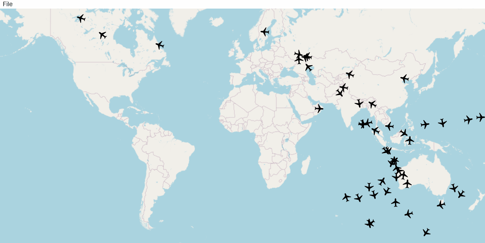

# ✈️ Flight Control Simulator

A real-time flight tracking simulator built in C# as part of an Object-Oriented Programming course at Warsaw University of Technology. The application receives live flight data over a network stream, interpolates aircraft positions over time, and renders them on an interactive world map.

---

## 🚀 Features

### Console Commands
| Command | Description |
|---------|-------------|
| `print` | Creates a snapshot of the dataset and saves it to a file |
| `report` | Displays the current data in the console |
| `exit` | Exits the application |

### SQL-like Query Interface
| Command | Syntax |
|---------|--------|
| `display` | `display {object_fields} from {object_class} [where {conditions}]` |
| `update` | `update {object_class} set ({key_value_list}) [where {conditions}]` |
| `delete` | `delete {object_class} [where {conditions}]` |
| `add` | `add {object_class} new ({key_value_list})` |

---

## 🛠 Technologies

